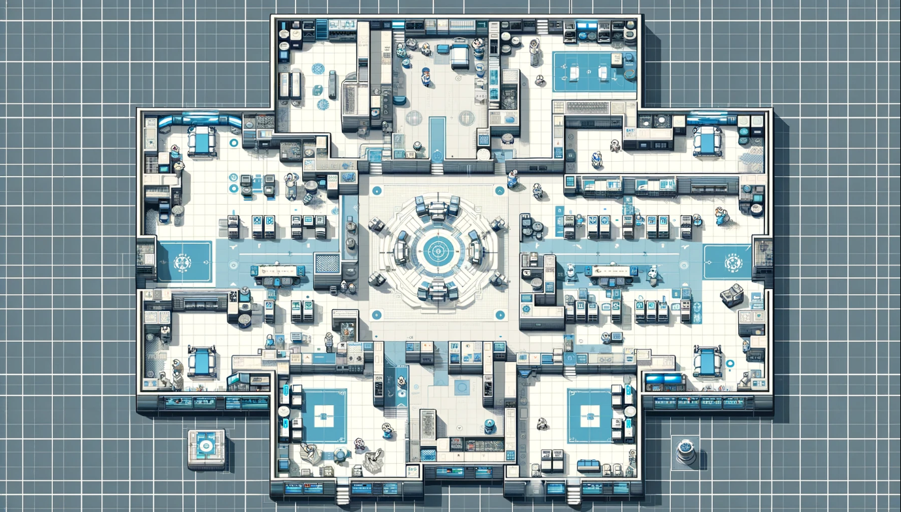

# Cast ҭӃҭӅ (Cast Away)

## StoryLine

The player wakes up on a planet, confused about their whereabouts. They encounter an alien who has taken them into a hospital (this is the first level). The player is confused and unsure what to do. They can decide whether to attack (and kill) the alien or be passive with the alien. Either of which will lead them to a distinct path within the storyline. The player stumbles around the facility to find a keycard to escape the facility.

Afterwards, the player discovers the alien residence. Full of vibrant rich alien buildings, fields, and citizen aliens. This area will all be enclosed in connected hallways to have a Martian civilization feel. They will act as NPC’s where you can complete certain tasks to gain the trust from the aliens or kills more aliens.

Eventually, the player will reach a spaceship. The alien king will be here, and based on the previous decisions of the player, they will either fight the alien king to the death, or the alien king will be cooperative with the player and allow the player to use the spaceship to go back to their home planet.

If the player took the aggressive, killing route, then the player will mention how confused they are, and how they got on this planet in the first place. If the player took the passive route, the alien king will explain how he saw the player fall out of the sky in a spaceship, and the player will start gaining back his memory (these hints at replaying the game and taking a more passive route), and vice versa.

## Rules

The main “rules” of the game is that the player will be able to fight or flee from aliens. The player will be enclosed in a map that has boundaries and will be able to traverse throughout different areas and complete various challenges until they reach the final boss, in which the game will end after the player makes their choice on what they will do (fight the boss or pick a more passive choice).

### Challenges

Requirements for the software and player challenges to control

---

  <table>
    <tr>
      <th>Challenge</th>
      <th>Teammate Challenge</th>
    </tr>
    <tr>
      <td>Doctor Alien</td>
      <td>Saad</td>
    </tr>
    <tr>
      <td>Citizen Alien</td>
      <td>Saad</td>
    </tr>
    <tr>
      <td>Superior Alien</td>
      <td>Bowen</td>
    </tr>
    <tr>
      <td>1st Level Challenge</td>
      <td>Omar</td>
    </tr>
    <tr>
      <td>2nd Level Challenge</td>
      <td>Omar</td>
    </tr>
    <tr>
      <td>3rd Level Challenge</td>
      <td>Hamza</td>
    </tr>
    <tr>
      <td>Pacifist Challenge</td>
      <td>Melvin</td>
    </tr>
    <tr>
      <td>Genocide Challenge</td>
      <td>Melvin</td>
    </tr>
  </table>

## Mock Up Image

## List of Class And Sequence Diagram

## Authors

- **Hamza Elkababji** - _Cool Guy Tough Guy_ -
  [Hamza](https://github.com/HamzaKababji)
- **Saad Al-Bayaty** - _Blud_ -
  [Saad](https://github.com/UWOSaadBayaty)
- **Omar Ramadan** - _Crip_ -
  [Omar](https://github.com/Omar1Ramadan)
- **Bowen Lin** - _Business Ambassdor_ -
  [Bowen](https://github.com/bowenlin1101)
- **Melvin Roger** - _Man Behind The Computer_ -
  [Melvin](https://github.com/mroger58)

See also the list of
[contributors]()
who participated in this project.

## License

This project is licensed under the [MIT License](LICENSE.md)
Creative Commons License - see the [LICENSE](LICENSE.md) file for
details
